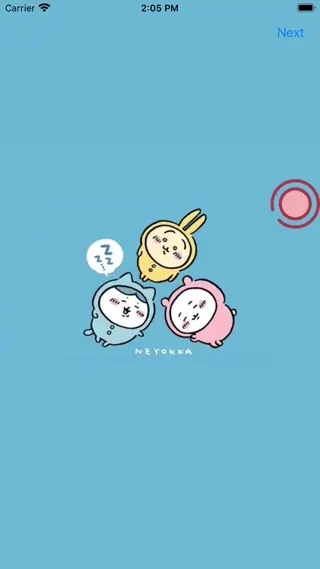

# WWAssistiveTouch

[](https://developer.apple.com/swift/) [](https://developer.apple.com/swift/)  [](https://developer.apple.com/swift/) [](https://developer.apple.com/swift/)

## [Introduction - 簡介](https://swiftpackageindex.com/William-Weng)
- Mimicking iPhone’s Assistive Touch function.
- 模仿iPhone手機的Assistive Touch功能



## [Installation with Swift Package Manager](https://medium.com/彼得潘的-swift-ios-app-開發問題解答集/使用-spm-安裝第三方套件-xcode-11-新功能-2c4ffcf85b4b)
```bash
dependencies: [
    .package(url: "https://github.com/William-Weng/WWAssistiveTouch.git", .upToNextMajor(from: "1.1.3"))
]
```

## [可用函式](https://ezgif.com/video-to-webp)
|函式|說明|
|-|-|
|init(touchViewController:frame:size:gap:icon:delegate:)|初始化AssistiveTouch|
|display(with:curve:)|顯示AssistiveTouch的內容|
|dismiss(with:curve:)|隱藏AssistiveTouch的內容|

## WWAssistiveTouchDelegate
|函式|說明|
|-|-|
|assistiveTouch(_:isTouched:)|AssistiveTouch是否被按下|
|assistiveTouch(_:status:)|AssistiveTouch的顯示狀態|

## Example
```swift
import UIKit
import WWAssistiveTouch

@main
final class AppDelegate: UIResponder, UIApplicationDelegate {
    
    var window: UIWindow?
    var assistiveTouch: WWAssistiveTouch!
    
    private lazy var touchViewController = { UIStoryboard(name: "Main", bundle: nil).instantiateViewController(withIdentifier: "Touch") }()
    
    func application(_ application: UIApplication, didFinishLaunchingWithOptions launchOptions: [UIApplication.LaunchOptionsKey: Any]?) -> Bool {
        assistiveTouch = WWAssistiveTouch(touchViewController: touchViewController, icon: UIImage(named: "Rec"), delegate: self)
        return true
    }
}

extension AppDelegate: WWAssistiveTouchDelegate {
    
    func assistiveTouch(_ assistiveTouch: WWAssistiveTouch, isTouched: Bool) {
        if (isTouched) { assistiveTouch.display() }
    }
    
    func assistiveTouch(_ assistiveTouch: WWAssistiveTouch, status: WWAssistiveTouch.Status) {
        print(status)
    }
}
```
```swift
import UIKit

final class TouchViewController: UIViewController {
    
    override func viewWillAppear(_ animated: Bool) {
        super.viewWillAppear(animated)
        
        view.alpha = 0.5
        
        UIViewPropertyAnimator(duration: 0.25, curve: .linear) { [unowned self] in
            view.alpha = 1.0
        }.startAnimation()
    }
    
    override func viewWillDisappear(_ animated: Bool) {
        super.viewWillDisappear(animated)
        view.alpha = 0.0
    }
    
    @IBAction func dismissTouchView(_ sender: UIButton) {
        guard let appDelegate = UIApplication.shared.delegate as? AppDelegate else { return }
        appDelegate.assistiveTouch.dismiss()
    }
}
```
